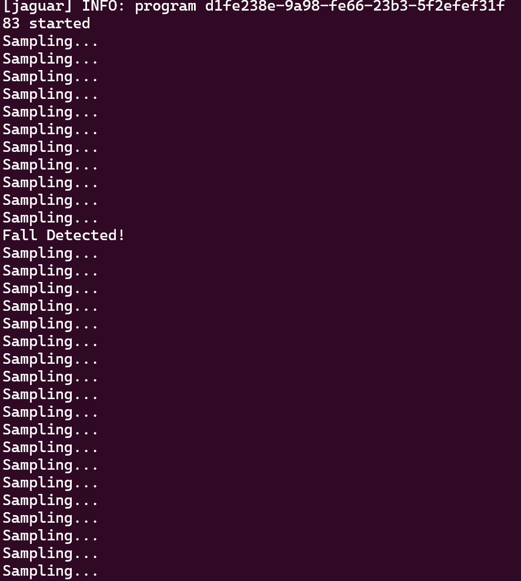

# Template repository for deploying Edge Impulse C++ Models on Toit-enabled devices


This repository provides a template for integrating Edge Impulse machine learning models with Toit-enabled devices. It allows you to easily deploy and run Edge Impulse models on your IoT hardware using the Toit programming language and runtime.


## Getting Started

1. Clone this repository:
   ```bash
   git clone https://github.com/yourusername/toit_edge_impulse.git
   cd toit_edge_impulse
   ```

2. Export your Edge Impulse model as a C++ library and place the files in the `build-root/model_folder` directory.

3. Required Patches (TBD): Some patches are currently needed to ensure compatibility between Edge Impulse models and the Toit runtime. This section will be updated with specific instructions for applying these patches.

4. Configuration
* Adjust or remove the C components in the `components` folder.
* add external esp-idf dependencies by modifiying idf_component.yml in components/fall_detection
* Run `make menuconfig` to configure the build.
* Adjust the [ci.yml](.github/workflows/ci.yml) file to match your setup. Typically, you don't need
  to compile on Windows or macOS.

### Build
* Run `make` to build the envelope. It should end up with a `build/esp32c6/firmware.envelope`.
   


## Makefile targets
- `make` or `make all` - Build the envelope.
- `make init` - Initialize after cloning. See the Setup section above.
- `make menuconfig` - Runs the ESP-IDF menuconfig tool in the build-root. Also creates the `sdkconfig.defaults` file.
- `make diff` - Show the differences between your configuration (sdkconfig and partitions.csv) and the default Toit configuration.
- `make clean` - Remove all build artifacts.

  
## Usage Example - Fall Detection: EI model: https://studio.edgeimpulse.com/public/23068/latest

```toit
import system.external
import io

FUNCTION-ID ::= 0

main:
  echo := external.Client.open "toitlang.org/demo-echo"
  threshold := 0.5
  while 1:
    response := io.Reader (echo.request FUNCTION-ID "fetch result")
    fall_probability := response.little-endian.read-float32

    if fall_probability >= threshold : print "Fall Detected!"

  echo.close
```


This repository was cloned from this [template](https://github.com/toitlang/template-custom-envelope).
