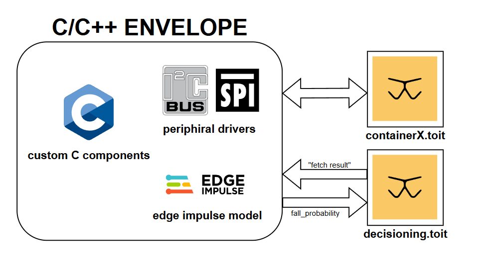
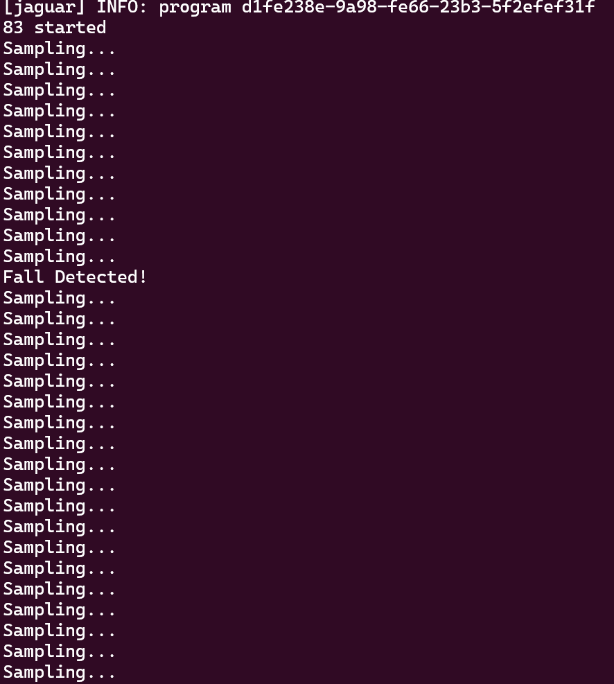

# Template Repository for Deploying Edge Impulse C++ Models on Toit-Enabled Devices

This repository serves as a template for deploying Edge Impulse machine learning (ML) models on Toit-enabled devices. The approach involves compiling the model and peripheral code into a Toit firmware "envelope", enabling seamless addition or removal of multiple Toit containers without requiring firmware recompilation or reflashing. The following diagram illustrates the process:   
<p align="center"></p>


For demonstration purposes, this guide uses the fall detection model available at [Edge Impulse Studio](https://studio.edgeimpulse.com/public/23068/latest), running on Lightbug (RH2 v2) tracker hardware.

---

## Getting Started

1. **Clone the Repository**:
   ```bash
   git clone https://github.com/abdalrahimnaser/toit_edge_impulse.git
   cd toit_edge_impulse
   ```

## Customize the model (optional)

1. **Export Your Edge Impulse Model**:
   - Export your Edge Impulse model as a C++ library.
   - Paste the exported model files into `build-root/model_folder`

2. **Customize Components**:
   - Add or remove top-level envelope C components in the `components` folder as needed.
   - To include external ESP-IDF dependencies, modify the `idf_component.yml` file in the same folder.

3. **Configure Build Settings**:
   - Run `make menuconfig` to configure the build settings.

Then continue with "Building the Firmware" step.

## Building the Firmware

1. **Build the Firmware Envelope**:
   - Execute `make` to compile the firmware envelope.
   - The compiled envelope will be located at `build/esp32c6/firmware.envelope`.
   - A precompiled version is already available in this location for convenience if no hardware or model changes are required.

2. **Flash the Firmware**:

   Currently you'll need https://github.com/toitlang/jaguar/releases/tag/v1.47.0 with Toit SDK v2.0.0-alpha.174

   ```bash
   jag flash build/esp32c6/firmware.envelope --chip esp32c6
   ```

3. **Monitor Deployment**:
   - Run `jag monitor` to allow deploying containers.
   - Note the IP address displayed by the ESP controller, as it will be required for deploying Toit apps/containers.

---

## Testing Toit Containers

The example app `decisioning.toit` (found in `components/fall_detection`) continuously requests fall detection probabilities from the firmware envelope and determines whether a fall event has occurred based on a threshold.

To test it:
1. Navigate to the file's location.
2. Run:
   ```bash
   jag run decisioning.toit -d <IP>
   ```
3. Observe the output in the `jag monitor` terminal, it should look something like this:
<p align="center"></p>

### Note:
- The default fall detection model used here has an accuracy of ~37%.
- A more-accurate-but-demanding model (~88% accuracy) can be found here [Edge Impulse Studio](https://studio.edgeimpulse.com/public/208622/latest).

---

## Makefile Targets

Here are some useful Makefile commands:

- `make` or `make all`: Build the firmware envelope.
- `make init`: Initialize after cloning.
- `make menuconfig`: Open ESP-IDF's menuconfig tool and create a `sdkconfig.defaults` file.
- `make diff`: Show differences between your configuration and Toit's default configuration.
- `make clean`: Remove all build artifacts.

---

## Common Issues and Fixes

These will need to be applied, before `make` is run and a working firmware envelope is built.

### 1. **CMake Error: CONFIG_FREERTOS_HZ** (Automated)

   This issue is now automatically handled by a script that runs with `make` commands.
   - Original Error:
     ```
     esp32-arduino requires CONFIG_FREERTOS_HZ=1000 (currently 100)
     ```
   - Original Fix: Modify line 369 in `build-root/managed_components/espressif__arduino-esp32/CMakeLists.txt` as follows:
     ```cpp
     if(NOT CONFIG_FREERTOS_HZ EQUAL 100 AND NOT "$ENV{ARDUINO_SKIP_TICK_CHECK}")
     ```

### 2. **Implicit Declaration Error**

   - Error in `ble_hs_flow.c`:
     ```
     implicit declaration of function 'ble_hci_trans_set_acl_free_cb'; did you mean 'ble_hci_trans_hs_acl_tx'? [-Werror=implicit-function-declaration]
     ```
   - Fix: Add this temporary workaround so the top of the `ble_hs_flow.c:` file:
     ```cpp
     int ble_hci_trans_set_acl_free_cb(os_mempool_put_fn *cb, void *arg) {
         return BLE_ERR_UNSUPPORTED; // Temporary workaround
     }
     ```

### 3. **Missing LSM6DS3.h**

   - Error: 
     ```
     fatal error: LSM6DS3.h: No such file or directory
     ```
   - Fix: Install the required library and adjust paths accordingly (see [tutorial](https://www.youtube.com/watch?v=7wOpKfeLd7w)).
     - Download https://github.com/Seeed-Studio/Seeed_Arduino_LSM6DS3/releases/tag/v2.0.4
     - Extract
     - Copy to `build-root\managed_components\espressif__arduino-esp32\libraries\Seeed_Arduino_LSM6DS3-2.0.4`
     - Replace `build-root\managed_components\espressif__arduino-esp32\CMakeLists.txt` with https://gist.github.com/addshore/13f2cf33f7f1cfa1cf0564d2e61964b7

### 4. **I2C Pin Initialization for Lightbug (RH2 v2) Tracker**

   This one will not stop the build, however will result in a non-functional I2C interface.

   - Fix: Change I2C pin initialization in `LSM6DS3.cpp` (line 88) to use pins `0,1`, so `Wire.begin(0,1);`

### 5. **Toit Deployment Fatal Error**

   - Error during deployment via `jag run`:
     ```
     fatal: Throwing new[] not allowed: 24
     ```
   - Fix: Set `throwing_new_allowed` to `true` in `toit/src/top.cc` (line 81).

--------------------
note: this repo was cloned from this template: https://github.com/toitware/demo-custom-envelope.git

